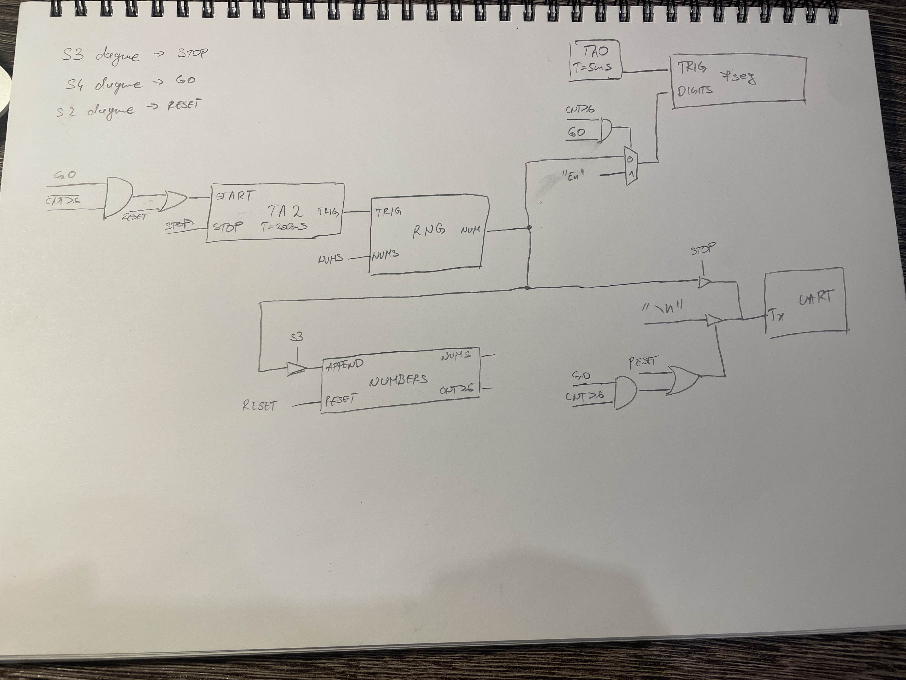

# Projekat iz predmeta mikrokontrolerski racunarski sistemi za godinu 2024
- zadatak i kratko objasnjenje resenja nalaze se u fajlu izvestaj.pdf
- sema softvera i sema hardvera su prilozene kao slike 

- glavni program se nalazi u main.c i function.c/.h, ostalo su fajlovi potrebni za ccstudio
- kod je napisan za msp430F5529
